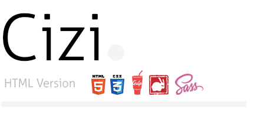

# Cizi <a href="https://eneserdogan.github.io/cizi/dist/"></a>
Clean And Minimalistic Personel Blog Theme. Jekyll version coming soon !

### Some Features
- Lightweight / easy on customize
- Minimal Design
- Responsive Layout
- Performance Optimized
- Valid Pages
- Sass,Gulp Support
- Syntax Highlighter(32 Language Support)


### What's included

Within the download you'll find the following directories and files, logically grouping common assets and providing both compiled and minified variations. You'll see something like this:

#### Development

```
app/
└── views/            
│    ├─────────| assets/
│    ├─────────────| sass/
│    ├─────────────────| base/            # Typography sass files
│    ├─────────────────| helphers/        # Sass variables files
│    ├─────────────────| layout/          # Layout sass files
│    ├─────────────────| pages/           # Pages sass files
│    ├─────────────────| vendor/          # 3rd party libraries
│    ├───────────────── main.scss         # Primary Sass file
│    ├─────────────| js/  
│    ├─────────────────| 3rd/             # 3rd party libraries
│    ├─────────────────| app.js           # Javascript File
│    ├─────────| templates/               # Includes jade files
│    ├─────────────| helpers/
│    ├───────────────── _mixin.jade
│    ├─────────────| partials/
│    ├───────────────── _head.jade
│    ├───────────────── _footer.jade
│    ├───────────────── _header.jade
├── 404.jade
├── about.jade
├── article.jade
├── article-comment.jade
├── category.jade
├── contact.jade
├── index.jade
└── search.jade
```
#### Builds
```
dist/
├── assets/
│   ├── css/
│   ├── js/
│   ├── fonts/
│   ├── img/
├── .htaccess
├── 404.html
├── about.html
├── article.html
├── article-comment.html
├── category.html
├── contact.html
├── index.html
└── search.html
```

## Customization

Here is the full list of default settings (found in `views/assets/sass/helpers/_variables.scss`);

``` scss

// LAYOUT

$body-background-color     : #ffffff          !default;
$body-selection-color      : #101c38          !default;
$body-selection-bg-color   : #f1f1f1          !default;
$container-max-width       : 700px            !default;
$mobile-size               : 480px            !default;
$tablet-size               : 767px            !default;
$landscape-size            : 667px            !default;

// FONT

$primary-font              : 'Roboto'         !default;
$primary-font-type         : "sans-serif"     !default;
$icon-font-family          : "ciziCleanIcon"  !default;


// COLOR

$body-font-color           : #101c38          !default;
$body-font-size            : 20px             !default;
$body-font-weight          : 300              !default;
$body-line-height          : 1.70             !default;
$body-mark-color           : #E20771          !default;
$body-blockquote-color     : #000000          !default;
$footer-text-color         : #000000          !default;


// FORM COLOR

$footer-input-color        : #101c38          !default;
$footer-input-bg-color     : #000000          !default;
$footer-input-placeholder  : #909090          !default;
$footer-input-focus-color  : #101c38          !default;
$footer-input-focus-bg     : #101c38          !default;
$footer-button-color       : #000000          !default;
$footer-button-bg-color    : #000000          !default;

// LINK COLOR

$body-link-color           : #101c38          !default;
$body-link-hover-color     : #E20771          !default;


// SOCIAL COLOR

$github-color              : #333333          !default;
$twitter-color             : #00aced          !default;
$facebook-color            : #3b5998          !default;
$googleplus-color          : #dd4b39          !default;
$pinterest-color           : #cb2027          !default;
$linkedin-color            : #007bb6          !default;
$youtube-color             : #bb0000          !default;
$vimeo-color               : #aad450          !default;
$tumblr-color              : #32506d          !default;
$instagram-color           : #517fa4          !default;
$flickr-color              : #ff0084          !default;
$dribbble-color            : #ea4c89          !default;
$wordpress-colo            : #21759b          !default;
$soundcloud-color          : #ff3a00          !default;
$stack-overflow-color      : #F48024          !default;
$skype-color               : #2CADE3          !default;
$behance-color             : #007CFF          !default;
$reddit-color              : #95c4f3          !default;


// ICON FONT

$cz-font-path              : "../fonts/"      !default;
$cz-search                 : "\f002"          !default;
$cz-envelope-o             : "\f003"          !default;
$cz-twitter                : "\f099"          !default;
$cz-facebook               : "\f09a"          !default;
$cz-facebook-f             : "\f09a"          !default;
$cz-github                 : "\f09b"          !default;
$cz-google-plus            : "\f0d5"          !default;
$cz-linkedin               : "\f0e1"          !default;
$cz-github-alt             : "\f113"          !default;
$cz-youtube                : "\f167"          !default;
$cz-stack-overflow         : "\f16c"          !default;
$cz-instagram              : "\f16d"          !default;
$cz-skype                  : "\f17e"          !default;
$cz-behance                : "\f1b4"          !default;
$cz-soundcloud             : "\f1be"          !default;
$cz-reddit-alien           : "\f281"          !default;
$cz-dribbble               : "\f17d"          !default;
$cz-slack                  : "\f198"          !default;
$cz-steam                  : "\f1b6"          !default;
$cz-snapchat-ghost         : "\f2ac"          !default;
```

## Pages

- [x] Home
- [x] About
- [x] Article
- [x] Category
- [x] Search
- [x] Contact
- [x] 404
- [ ] Portfolio (Soon)

## Gulp

```bash
$ [sudo] npm install
```
```bash
$  gulp
```
(`Child Theme Create`)

```bash
$  gulp zip
```

## Version

See [the Releases section of our GitHub project](https://github.com/eneserdogan/cizi/releases) for changelogs for each release version of Cizi.

## License
The MIT License (MIT)

Copyright (c) 2016 Enes Erdoğan

Permission is hereby granted, free of charge, to any person obtaining a copy
of this software and associated documentation files (the "Software"), to deal
in the Software without restriction, including without limitation the rights
to use, copy, modify, merge, publish, distribute, sublicense, and/or sell
copies of the Software, and to permit persons to whom the Software is
furnished to do so, subject to the following conditions:

The above copyright notice and this permission notice shall be included in all
copies or substantial portions of the Software.

THE SOFTWARE IS PROVIDED "AS IS", WITHOUT WARRANTY OF ANY KIND, EXPRESS OR
IMPLIED, INCLUDING BUT NOT LIMITED TO THE WARRANTIES OF MERCHANTABILITY,
FITNESS FOR A PARTICULAR PURPOSE AND NONINFRINGEMENT. IN NO EVENT SHALL THE
AUTHORS OR COPYRIGHT HOLDERS BE LIABLE FOR ANY CLAIM, DAMAGES OR OTHER
LIABILITY, WHETHER IN AN ACTION OF CONTRACT, TORT OR OTHERWISE, ARISING FROM,
OUT OF OR IN CONNECTION WITH THE SOFTWARE OR THE USE OR OTHER DEALINGS IN THE
SOFTWARE.
